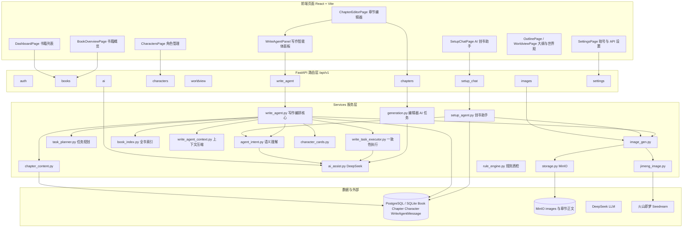
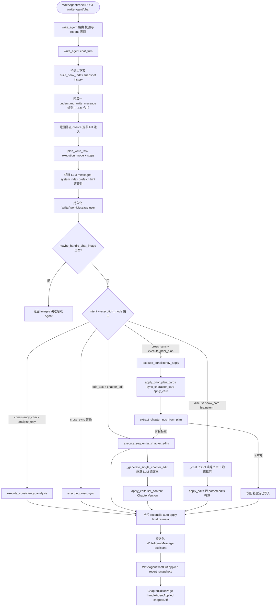
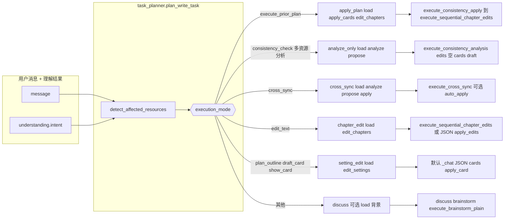
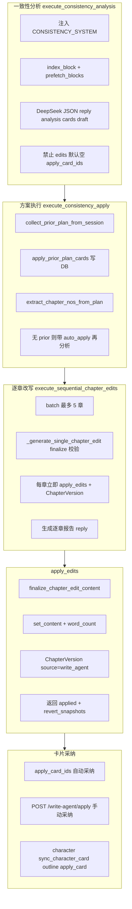
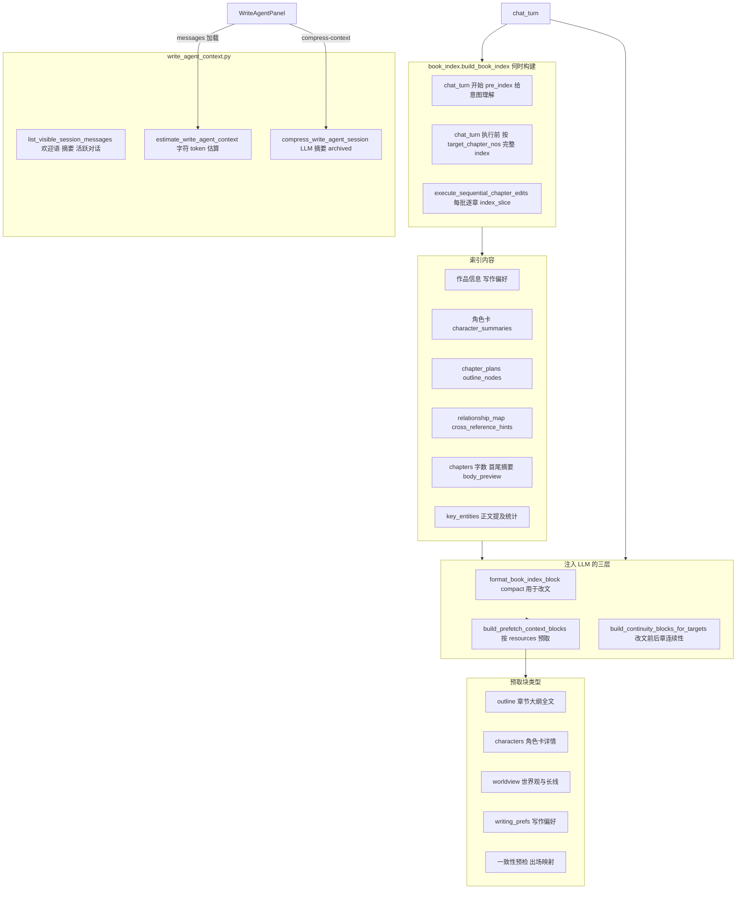
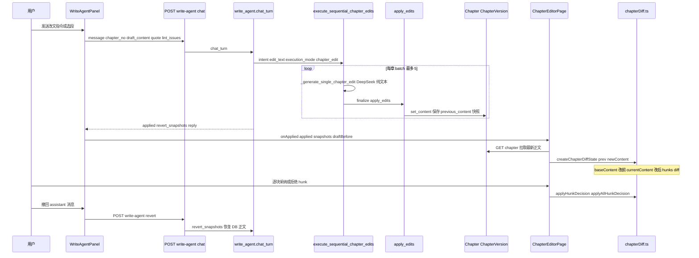
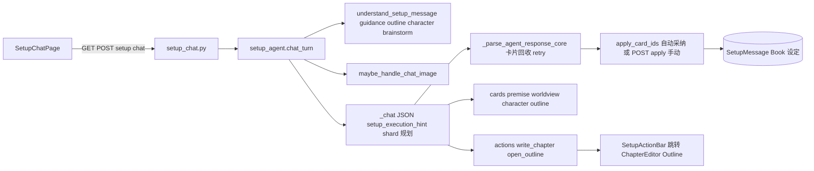
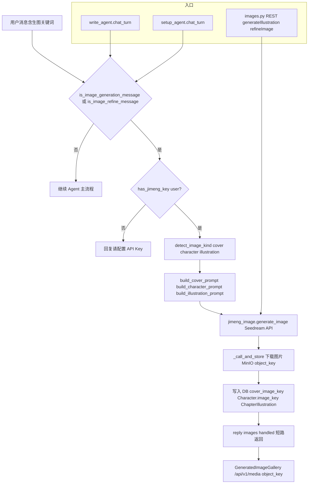

# NovFlow 系统架构与设计

> 本文档基于 `novflow/` 源码实际调用路径编写，与 [README](../README.md) 中的部署与使用说明互补。

---

## 1. 项目概览

NovFlow 是面向非技术网文作者的 **AI 长篇创作工作台**：设定管理、章节 AI 写作、规则质检、定稿导出，核心差异化是「带门禁的结构化协作」——先建设定库，再分章生产，Agent 自动写入后用户可在编辑器中逐块审阅 diff。

### 1.1 技术栈

| 层级 | 技术 | 说明 |
|------|------|------|
| 前端 | React 18 + Vite + TypeScript + Tailwind | SPA，章节编辑器 + 写作/创书 Agent 面板 |
| 后端 | FastAPI + SQLAlchemy | REST API `/api/v1`，Swagger `/docs` |
| 数据库 | SQLite（本地）/ PostgreSQL（Docker） | 元数据、设定、对话、版本历史 |
| 对象存储 | MinIO（可选） | 章节 Markdown 正文、生成图片 |
| LLM | DeepSeek Chat API | 语义理解、JSON 结构化输出、纯文本改章 |
| 图像 | 火山即梦 Seedream | 封面 / 角色立绘 / 章节插图 |
| 部署 | Docker Compose + Nginx | 生产模式前后端一体 |

### 1.2 存储策略

| 模式 | 数据库 | 章节正文 | 启动 |
|------|--------|----------|------|
| 本地开发 | SQLite | DB TEXT 列 | `start.ps1` |
| Docker | PostgreSQL | MinIO `{book_id}/{chapter_no}.md` | `docker compose up -d` |

元数据始终存 DB；未启用 MinIO 时 `chapter_content.py` 自动回退 DB，本地工作流不受影响。

---

## 2. 智能体编排哲学

NovFlow 的写作 Agent 采用 **「理解 → 规划 → 路由 → 执行 → 落库」** 五层编排，而非单一 LLM 调用包办一切。

1. **理解**（`agent_intent.understand_write_message`）：规则引擎（关键词、选段、历史延续、多资源判定）与 LLM 结构化 JSON 合并，产出带 `allow_edits / allow_cards / execute_prior_plan` 等约束的 `understanding`。
2. **规划**（`task_planner.plan_write_task`）：根据 `understanding` 与 `book_index` 生成 `execution_mode`（`analyze_only`、`cross_sync`、`apply_plan`、`chapter_edit`、`discuss` 等）及步骤链。
3. **路由**（`write_agent.chat_turn`）：按 `intent + execution_mode` 选择专用执行器，避免分析任务误改正文、头脑风暴误输出卡片。
4. **执行**：一致性分析 / 跨资源同步 / 逐章改文 / 默认 JSON 对话，各走独立路径与校验逻辑。
5. **落库**：`apply_edits` 写正文 + `ChapterVersion` 快照；卡片经 `apply_card` / `sync_character_card` 写设定；前端 `chapterDiff.ts` 提供逐块审阅。

创书助手（`setup_agent`）共享语义理解与即梦生图短路，但**不走** `task_planner` / `write_task_executor` 多资源流水线，聚焦建书阶段卡片草案与阶段导航。

---

## 3. 架构图

### 3.1 系统总览



### 3.2 写作 Agent 编排流水线（核心）

#### 3.2a 主流程：从前端到写入



#### 3.2b 决策分支：execution_mode 与 intent



#### 3.2c 执行器细节



### 3.3 上下文与索引层



限额常量定义于 `context_limits.py`（如 `MAX_HISTORY_MESSAGES=48`、`SNAPSHOT_CHAPTERS_TOTAL_CHARS=300_000`）。

### 3.4 数据流：章节编辑与 Diff



### 3.5 Setup Agent / AI 创书助手



与写作 Agent 的差异：创书助手聚焦**建书阶段**，不走 `task_planner` / `write_task_executor`；两者共用 `agent_intent` 两阶段模式与 `image_gen` 生图短路。

### 3.6 图像生成流程（即梦 / Jimeng）



---

## 4. 关键模块表

| 模块 | 路径 | 职责 |
|------|------|------|
| 应用入口 | `backend/app/main.py` | 路由注册、生命周期、SPA 静态托管 |
| 写作 Agent 路由 | `backend/app/routers/write_agent.py` | chat / messages / apply / revert / compress |
| 创书助手路由 | `backend/app/routers/setup_chat.py` | 建书对话与卡片采纳 |
| 章节 CRUD | `backend/app/routers/chapters.py` | 正文读写、定稿、lint、GenerationJob |
| 写作编排核心 | `backend/app/services/write_agent.py` | `chat_turn` 五层编排、apply_edits、会话管理 |
| 语义理解 | `backend/app/services/agent_intent.py` | 两阶段 intent、改文校验、salvage、brainstorm |
| 任务规划 | `backend/app/services/task_planner.py` | `execution_mode`、资源检测、步骤分解 |
| 多资源执行 | `backend/app/services/write_task_executor.py` | 一致性分析/采纳、跨资源同步 |
| 全书索引 | `backend/app/services/book_index.py` | 结构化 index、prefetch、连续性块 |
| 上下文压缩 | `backend/app/services/write_agent_context.py` | 可见消息筛选、LLM 摘要压缩 |
| 创书助手 | `backend/app/services/setup_agent.py` | 5 步向导对话、卡片 apply、shard 规划 |
| 规则质检 | `backend/app/services/rule_engine.py` | 逗号/破折号/字数/标题等 lint |
| 系统规约 | `backend/app/services/system_writing_rules.py` | 平台合规规则（用户不可见） |
| 编辑器 AI | `backend/app/services/generation.py` | 异步 GenerationJob（生成/扩写/修复） |
| 图像编排 | `backend/app/services/image_gen.py` | 意图检测、prompt、MinIO 持久化 |
| 即梦客户端 | `backend/app/services/jimeng_image.py` | Seedream HTTP 调用 |
| 正文存储 | `backend/app/services/chapter_content.py` | MinIO / DB 双模式读写 |
| 前端 Agent 面板 | `frontend/src/components/write/WriteAgentPanel.tsx` | 对话 UI、上下文状态、compress |
| 章节 Diff | `frontend/src/utils/chapterDiff.ts` | hunk 级采纳/拒绝/合并 |
| API 客户端 | `frontend/src/api.ts` | 统一 REST 封装 |

---

## 5. 部署快速参考

完整步骤见 [README](../README.md)。摘要如下：

**本地（Windows）**

```powershell
copy .env.example .env   # 填入 DEEPSEEK_API_KEY
.\start.ps1              # http://127.0.0.1:8000
```

**开发热更新**

```powershell
.\start-backend.ps1      # 终端 1
cd frontend && npm install && npm run dev   # 终端 2 → http://localhost:5173
```

**Docker**

```powershell
docker compose up -d --build   # http://localhost + PostgreSQL + MinIO
```

健康检查：`GET /api/v1/health` 返回 DB 类型、MinIO、DeepSeek/Jimeng 配置状态。

---

## 6. 深度架构分析

### 6.1 效率评估

**多阶段 Agent 流水线是否高效？**

- **优点**：意图与执行分离显著降低「分析误改文」「brainstorm 误出卡片」等越权，减少无效重试与人工纠错成本；生图意图在 `maybe_handle_chat_image` 处短路，避免浪费主 Agent token。
- **成本**：典型一轮 `chat_turn` 至少 **2 次 LLM 调用**——`understand_write_message`（JSON）+ 主执行（JSON 或纯文本）。多章改文走 `execute_sequential_chapter_edits` 时 **每章额外 1 次**（batch ≤ 5）；一致性「分析 → 用户确认 → 执行」可达 **3–4+ 次**。
- **上下文冗余**：`chat_turn` 内 `build_book_index` **调用两次**（`pre_index` 供意图理解，完整 index 供执行）；system 消息栈常含 index + task_plan + 多个 prefetch + continuity + 最多 48 条历史，改文场景 token 开销大（`context_limits` 单书快照上限约 30 万字符量级）。
- **重复 LLM**：规则引擎 `_rule_write_intent` 与 LLM 理解存在意图重叠；brainstorm 失败会 **自动重试一次**；会话压缩 `compress_write_agent_session` 再增 1 次 LLM。
- **未用能力**：`deepseek.chat_completion` 支持 `stream=True`，但 Agent 与编辑器 AI 均为 **同步整段返回 + 前端轮询**（GenerationJob），首 token 延迟高。

**结论**：编排设计在**质量与可控性**上合理，但在 **token 成本与延迟** 上对高频改章、多章批量不够经济；尚未做 prompt 缓存、index 增量更新或理解/执行合并的短路优化。

### 6.2 设计质量与 SOLID 原则

| 层级 | 内聚 | 耦合 | 评价 |
|------|------|------|------|
| **Routers** | 高 | 低 | 薄层：鉴权、DTO、委托 service，符合 SRP |
| **task_planner / write_task_executor / book_index** | 高 | 低 | 职责清晰，可单测（已有 `test_task_planner`、`test_consistency_apply`） |
| **agent_intent** | 中 | 中 | 混合意图解析、改文校验、salvage、brainstorm（~1500 行），SRP 偏弱 |
| **write_agent.py** | 低 | 高 | ~2260 行 God Module：编排、快照、apply、卡片、大纲、历史、路由全在一处 |
| **setup_agent ↔ write_agent** | 中 | 高 | 共享 `apply_card`、`reconcile_cards_with_book`；卡片模型与解析逻辑耦合 |
| **write_agent_context ↔ write_agent** | 中 | 高 | **循环依赖**：context 延迟 import `_assistant_content_for_history` |
| **Frontend** | 高 | 低 | 页面 + `api.ts` + utils，Agent 面板通过 callback 与编辑器协作，边界清楚 |

**耦合过紧处**

1. `write_agent.py` 与 `setup_agent.py` 互借卡片/apply 实现，新增卡片类型需改多处。
2. `agent_intent` 的关键词列表与 `write_agent` / `task_planner` 关键词 **三处维护**，易漂移。
3. 章节 AI 存在 **双路径**：编辑器按钮 → `generation.py`（GenerationJob）；写作面板 → `write_agent.chat_turn`，prompt 与规约注入逻辑未完全统一。

### 6.3 可扩展性

| 扩展点 | 难度 | 说明 |
|--------|------|------|
| **新 write intent** | 中 | 需改 `VALID_WRITE_INTENTS`、`_rule_write_intent`、`plan_write_task` 分支、`chat_turn` 路由，无插件/registry |
| **新 execution_mode** | 中 | 在 `task_planner` 加分支 + `chat_turn` 加 executor 调用 |
| **新 image provider** | 中高 | 逻辑集中在 `jimeng_image.py` + `image_gen._call_and_store`，缺 Provider 接口 |
| **新 card type** | 中高 | `apply_card`、`sync_character_card`、`reconcile_cards_with_book`、前端 `SetupCard` 均需扩展 |
| **新 lint rule** | **低** | `rule_engine.lint_chapter` 返回 `LintResult` 列表，模式清晰；前端 `lintHighlight.ts` 需同步 rule_id |

**有助扩展的模式**：execution_mode 步骤链、prefetch 按 resource 键扩展、`context_limits` 集中限额、系统/作者规约分层（`system_writing_rules` + DB 偏好）。

**阻碍扩展的模式**：巨型 `write_agent.py`、分散关键词、无统一 Agent Tool/Executor 注册表。

### 6.4 缺口与技术债

**部分实现或未完全贯通**

- README 已列：章节历史版本未迁 MinIO；AI 生成非 SSE；Docker 无法读宿主机模板目录。
- `deepseek` 流式 API 未接入 Agent/编辑器 UI。
- 创书助手与写作 Agent **卡片协议相似但非同一抽象**，`SetupCardOut` 与 write agent 复用 schemas 仍靠约定。
- `generation.py` 与 `write_agent` 改文路径并行，行为可能不一致（版本 note、lint 同步时机）。
- 认证为演示级单用户，无邮箱验证、无多租户隔离。
- 无 Agent 执行 **trace_id** / 结构化 audit log，难以复盘「哪步 LLM 产出了什么」。

**错误处理**

- LLM/即梦失败多转为用户可见 `reply` 或 HTTP 4xx，缺少统一错误码与可重试策略（除 brainstorm 一次 retry）。
- `apply_edits` 有 `finalize_chapter_edit_content` 校验，但跨章批量部分失败时用户依赖 reply 文本判断，无 per-chapter 结构化 status。

**测试**

- 现有 7 个测试文件，覆盖 planner、consistency apply、edit salvage、selection edit、rule_engine、ai_lint_filter；**无** `chat_turn` 集成测试、无 frontend 测试、无 E2E。
- Routers / generation job / image_gen 几乎无测试。

**可观测性**

- 仅 `logging.basicConfig(INFO)`；无 metrics、无 LLM token 用量记录、无耗时 span。

### 6.5 优化建议（按优先级）

#### P0 — 高收益、改动可控 ✅

1. ✅ **合并或缓存 book_index 构建**：意图阶段用轻量 hint；执行阶段单次 `build_book_index`（扩展同步时最多二次）。
2. ✅ **抽取 write_agent 路由表**：`write_agent_routing.py` registry + `write_agent_apply.py` / `write_agent_cards.py` 子模块。
3. ✅ **统一关键词/意图常量**：`agent_constants.py` 供 intent / planner / write_agent 共用。
4. ✅ **记录 LLM 调用元数据**：`meta_json` 含 `call_count`、`estimated_tokens`、`execution_mode`、`llm_calls`。

#### P1 — 体验与维护 ✅

5. ✅ **Agent 响应 SSE 流式**：`POST /write-agent/chat/stream` + `WriteAgentPanel` 流式展示 reply。
6. ✅ **Image Provider 抽象**：`image_providers/base.py`（`ImageProvider` / `JimengProvider`）。
7. ✅ **补 chat_turn 集成测试**：`tests/test_write_agent_chat_turn.py`（routing + analyze/apply 路径）。
8. ✅ **打破 write_agent ↔ write_agent_context 循环依赖**：`message_format.py` 承载 `assistant_content_for_history`。

#### P2 — 中长期（部分完成）

9. ✅ **合并 generation 与 write_agent 改文内核**：`chapter_edit_kernel.py` + `generation.apply_content` 共用 `finalize_chapter_edit_content` / `set_content`。
10. ✅ **Card 类型插件化**：`card_handlers.py` 注册表驱动 `apply_card`。
11. ✅ **可观测性栈**：`observability.py` 结构化 JSON 日志 + `LLMCallTracker`（非完整 OpenTelemetry）。
12. ⏸ **MinIO 迁移 chapter_versions**（未实施，按需求跳过）。

---

## 7. 相关文档

- [README](../README.md) — 快速开始、Docker、使用流程、MVP 限制
- [HYBRID_ARCHITECTURE.md](./HYBRID_ARCHITECTURE.md) — 本地 + 云端 + 管理后台混合架构可行性
- [STANDALONE_DESKTOP.md](./STANDALONE_DESKTOP.md) — 本地独立安装包与零配置可行性
- API 文档 — 启动后访问 `/docs`
