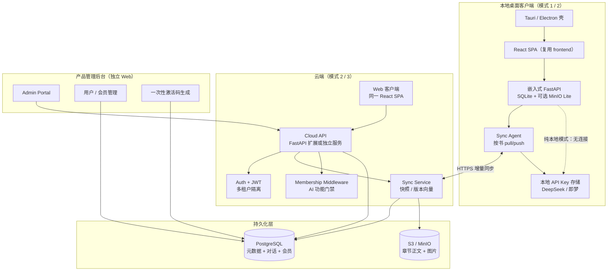

# NovFlow 混合架构扩展 — 技术可行性分析报告

> 基于 `novflow/` 源码（`ARCHITECTURE.md`、`models.py`、`auth.py`、`config.py`、`chapter_content.py`、`storage.py`、`main.py` 及各路 router）的评估。  
> **结论先行：部分可行，置信度约 75%。**  
> 评估日期：2026-06

---

## 1. 总体可行性

| 维度 | 判定 | 说明 |
|------|------|------|
| **整体** | **Partial（部分可行）** | 写作/Agent/编辑器/Web 栈成熟，可复用；同步、桌面打包、商业化层几乎空白 |
| **置信度** | **75%** | 技术路径清晰，风险集中在离线同步与 ID 体系重构，非原理性不可行 |
| **三种部署模式共存** | Partial | 模式 2/3 可基于现有 Docker 栈扩展；模式 1 需新建桌面壳 + 嵌入式后端 |
| **按书云同步** | Partial | 需新增全局 UUID、版本元数据、同步 API；不宜直接 CRDT |
| **Web 客户端** | **Yes** | 现有 React SPA 可直接对接云 API |
| **Admin + 激活码 + 会员** | **Yes** | 与现有业务解耦，独立模块即可 |

### 目标产品形态

1. **本地独立软件** — 数据不上云，用户自行管理
2. **按书上云** — 用户选择特定书籍开启云同步，出差/临时设备可在网页端继续创作
3. **本地打开「上云」书籍** — 自动 pull/push 同步
4. **产品管理后台** — 创建用户、生成一次性桌面激活码、分配会员（限时/终身）；会员到期锁定 AI 功能，仍允许导出作品

---

## 2. 目标架构图（Mermaid）



---

## 3. 分组件分析

### 3.1 本地桌面客户端（基于现有 standalone 方案）

**现状**

- 「本地 standalone」= `start.ps1`：Python venv + `uvicorn` + SQLite（`data/novflow.db`）+ 前端 build 静态托管
- 无 Electron/Tauri、无系统托盘、无离线安装包、无自动更新
- `chapter_content.py` 已支持 DB TEXT 回退，适合纯本地

**可行路径**

| 方案 | 工作量 | 优劣 |
|------|--------|------|
| **A. Tauri + sidecar Python** | 中 | 体积小；需打包 Python 运行时 |
| **B. Electron + 内嵌 uvicorn** | 中高 | 生态成熟；包体积大 |
| **C. 继续「本地 Web」+ 安装器** | 低 | 最快；体验偏开发者工具 |

**关键改造**

- 配置层区分 `DEPLOYMENT_MODE=local|hybrid`
- 本地 DB 与云端 **book 使用不同 ID 空间**：本地 `local_id` + 全局 `cloud_book_uuid`
- API Key **仅存本地**（见 3.8），云端 Agent 调用需「本地代理 LLM」或「云端代调 + 用量计费」二选一

**评估：可行，15–25 人日（含打包、更新、首次运行向导）**

---

### 3.2 Cloud API / 多租户后端

**现状**

- 单一 FastAPI 单体，`Book.user_id` 已有租户雏形
- 各 router 通过 `_owned` / `_get_owned` 校验 `Book.user_id == user.id`（如 `books.py`、`write_agent.py`）
- 开放注册（`/auth/register`），无 Admin、无 RBAC、无 rate limit
- Docker Compose 已有 PostgreSQL + MinIO 生产栈

**推荐：扩展当前 FastAPI，而非立即拆微服务**

```
backend/app/
  routers/          # 现有业务 API
  routers/admin/    # 新增：用户、激活码、会员
  routers/sync/     # 新增：按书同步
  services/sync/    # 同步引擎
  middleware/       # membership_gate
```

**理由**

- 业务逻辑（Agent、章节、卡片）已在同一 codebase，拆服务需重复部署 Agent 依赖（DeepSeek、即梦）
- 先用 **模块化单体 + PostgreSQL 强制多租户**，待 QPS/团队规模上来再拆 Sync Service

**必须新增的数据模型（示例）**

```python
# 概念字段，非实现
Book.cloud_uuid          # 全局唯一
Book.sync_enabled        # 用户 opt-in 云同步
Book.last_synced_at
Book.sync_version        # 单调递增
User.membership_tier
User.membership_expires_at
ActivationCode           # code_hash, used_at, used_by_user_id
SyncChangeLog            # entity_type, entity_id, version, payload_hash
```

**评估：可行，10–15 人日（多租户加固 + 云部署基线）**

---

### 3.3 同步协议：CRDT vs LWW vs 版本向量

**数据类型与推荐策略**

| 实体 | 特点 | 推荐协议 | 冲突策略 |
|------|------|----------|----------|
| **章节正文** | 大文本、单章单编辑者为主 | **LWW + `updated_at` + 内容 hash** | 默认新者胜；冲突弹窗让用户选版本 |
| **ChapterVersion** | 追加历史 | **Append-only 复制** | 按 `created_at` 合并，不去重 |
| **角色/设定卡片** | 结构化 JSON | **Per-record LWW + 版本号** | 字段级合并可选（P2） |
| **WriteAgentMessage / SetupMessage** | 追加对话 | **Incremental pull by id/created_at** | 极少双端同时写同 session；发生时整 session 以较新 `session_id` 为准 |
| **GenerationJob** | ephemeral | **不同步或仅同步终态** | 进行中 job 各端独立 |
| **前端 chapterDiff 状态** | 纯客户端 | **不同步** | 打开章节时从服务端拉最新正文重建 |
| **MinIO 图片** | 二进制 blob | **Content-addressed（hash key）+ 引用表同步** | 先传 blob 再 sync 元数据 |

**为何不推荐 CRDT（Yjs/Automerge）作为 MVP**

- NovFlow 是「单用户单章编辑 + Agent 批量写入」，非 Google Docs 式协同
- Agent 一次 `apply_edits` 可能改多章，CRDT 与 `ChapterVersion` / `revert_snapshots` 语义冲突
- 引入 CRDT 需重写编辑器存储层，**ROI 低**

**推荐 MVP 协议：「整书快照 + 增量变更日志」**

1. 用户开启云同步 → 首次 **full snapshot upload**（JSON + 章节 MD + 图片 manifest）
2. 之后 **change log push**：`(entity_type, cloud_uuid, version, updated_at, payload_ref)`
3. Pull：`since_version` 拉取变更；本地合并后 bump `sync_version`
4. 双端离线编辑同一章 → 检测 `content_hash` 不一致 → **冲突标记**，UI 提供「保留本地 / 保留云端 / 手动合并」

**Agent 聊天 / diff 状态**

- `WriteAgentMessage.meta_json` 含 `revert_snapshots` 等——随消息 **整行同步**即可
- 客户端 diff（`chapterDiff.ts`）是审阅 UI 状态，**关闭重开后从服务端正文重建**，无需 sync

**评估：MVP 用 LWW + 版本向量可行；完整离线双写冲突 UX 需 20–30 人日**

---

### 3.4 按书云标志与 local→cloud 迁移

**现状**：`Book` 无 `sync_enabled`、`cloud_uuid`；ID 为自增整数，跨设备会碰撞。

**迁移流程（建议）**

```
用户点击「上传此书到云端」
  → 本地生成 cloud_book_uuid
  → POST /sync/books { local_snapshot, cloud_uuid? }
  → 云端分配 user 命名空间，返回 cloud_book_id + initial_sync_version
  → 本地写入 cloud_uuid, sync_enabled=true, sync_cursor
  → 上传 MinIO 对象（key 改为 {user_id}/{cloud_uuid}/...）
```

**注意**

- 现有 MinIO key 为 `{book_id}/{chapter_no}.md` 和 `images/{book_id}/...`——**必须改为 cloud_uuid 前缀**，否则多租户泄漏风险
- `sync-settings`（`POST /books/{id}/sync-settings`）是 **Setup Agent 卡片落库**，与云同步无关，命名易混淆

**评估：可行，8–12 人日（含 UI + 迁移向导 + key 重构）**

---

### 3.5 Web 客户端复用

**现状**

- React 18 + Vite + TypeScript + Tailwind，页面完整（Dashboard、ChapterEditor、WriteAgentPanel 等）
- `api.ts` 统一 REST，`const API = "/api/v1"` 相对路径
- Docker 下 Nginx 反代；本地 dev 5173 → 8000

**复用方式**

| 项 | 改动 |
|----|------|
| 部署 | 同一 build 部署到 `app.novflow.com` |
| API 基址 | 环境变量 `VITE_API_BASE` |
| 认证 | 复用 JWT Bearer（`deps.get_current_user`） |
| 功能裁剪 | 会员过期时前端隐藏 Agent 入口 + 后端 403 双保险 |
| 本地模式 | 桌面壳指向 `127.0.0.1:8000`，Web 指向云端 |

**评估：高复用，5–10 人日（云登录、同步状态 UI、会员提示）**

---

### 3.6 Admin 门户

**现状**：无 admin 路由、无 superuser 模型。

**推荐：独立小型 Admin SPA（React/Vue）+ `/api/v1/admin/*`**

- 与作者端隔离，降低误暴露风险
- Admin JWT 独立 issuer 或 `User.role = admin`
- 功能：用户 CRUD、激活码批量生成、会员延期/终身、用量概览

**备选 `/admin` 同仓路由**：开发快，但 SPA 打包与权限边界模糊，**不推荐长期方案**。

**评估：可行，12–18 人日**

---

### 3.7 激活码设计

**需求**：一次性、用后销毁、绑定桌面软件激活。

**推荐：DB 表 + HMAC 存储，非 JWT**

| 方案 | 评价 |
|------|------|
| **JWT 激活码** | 难撤销、难审计、泄露后无法「销毁」 |
| **纯随机码 + DB** | ✅ 推荐 |
| **HMAC(secret, payload)** | 可用于 **离线校验格式**，但仍需服务端核销 |

**表结构（概念）**

```
activation_codes:
  id, code_hash (SHA256), plan_type, duration_days
  created_by_admin_id, created_at
  redeemed_at, redeemed_by_user_id, redeemed_device_fingerprint
  status: pending | used | revoked
```

**流程**

1. Admin 生成码 → 展示一次明文 → DB 存 hash
2. 桌面端 `POST /auth/activate { code, device_id }` → 核销 → 签发 JWT + 写入 membership
3. 已用码拒绝重复核销

**评估：straightforward，3–5 人日（含 Admin UI）**

---

### 3.8 订阅 / 会员与功能门禁

**需求**：到期锁定 AI 编辑，**允许导出**。

**现状**

- 导出：`GET /books/{book_id}/export` 已有（`export_book_txt`）
- AI 入口分散：`write_agent/*`、`setup_chat/*`、`chapters` 的 generate/fix、`ai/*`、`images/*`

**实现**

```python
# middleware 或 Depends
def require_ai_membership(user: User):
    if user.membership_expires_at and user.membership_expires_at < now:
        if user.membership_tier != "lifetime":
            raise HTTPException(403, "会员已过期，请续费。您仍可导出作品。")

# 白名单（不过 gate）
ALLOW_WITHOUT_MEMBERSHIP = [
    "GET /books", "GET /books/{id}/export",
    "GET /chapters", "PUT /chapters",  # 手动编辑可议
    "GET /auth/me", ...
]
```

**产品决策点**

- 「锁定 AI 编辑」是否包含 **手动章节编辑**？建议：**允许手动编辑 + 导出 + 阅读**，仅禁 Agent / 生成 / 生图 / lint-AI
- API Key：会员过期后本地 Key 仍可用（用户自备），云端代调则需 gate——**建议桌面走本地 Key，云端走 gate**

**评估：可行，5–8 人日**

---

## 4. 当前代码库就绪度

| 能力 | 状态 | 证据 |
|------|------|------|
| 核心业务（书/章/Agent/卡片/导出） | ✅ 成熟 | `models.py`、Agent 五层流水线 |
| 本地 SQLite 模式 | ✅ 可用 | `config.py` `DB_PATH`，`start.ps1` |
| 云 Docker 栈 | ✅ 可用 | `docker-compose.yml` PG + MinIO |
| 章节正文双存储 | ✅ 可用 | `chapter_content.py` + `storage.py` |
| 用户级 API Key | ✅ 部分 | `User.deepseek_api_key`，`api_key.py` |
| 多租户数据模型 | ⚠️ 雏形 | `Book.user_id`，无 org/team |
| 认证 | ⚠️ 演示级 | JWT + 开放注册，无邮箱验证 |
| 按书云同步 | ❌ 无 | 无 sync router / 无 cloud_uuid |
| 全局 ID / 版本元数据 | ❌ 无 | 整型自增 ID |
| 桌面安装包 | ❌ 无 | 仅 PowerShell 脚本 |
| Admin / 激活码 / 会员 | ❌ 无 | 模型与路由均不存在 |
| 计费 / 支付 | ❌ 无 | — |
| 结构化 audit / 同步日志 | ❌ 无 | 仅有 `observability.py` LLM 追踪 |
| 测试覆盖 sync 场景 | ❌ 无 | 7 个测试文件，无 E2E |
| MinIO 多租户 key | ❌ 不安全 | `{book_id}/` 无 user 前缀 |
| API Key 加密存储 | ❌ 明文 | `User.deepseek_api_key` 明文列 |

---

## 5. 主要技术风险与挑战

### 5.1 离线优先同步复杂度 — **高**

- Agent 一轮改多章 + `revert_snapshots` 使「字段级合并」极难
- 建议 MVP：**在线同步为主**，离线队列仅缓存 push，冲突以章为单位人工解决

### 5.2 Agent 聊天 / diff 状态同步 — **中高**

- 消息体量大（`meta_json`、prefetch 残留），全量同步费带宽
- 需 **分页 incremental sync** + 可选「仅同步最近 N 条消息」策略
- 前端 diff 状态不同步是正确设计，但需在 UX 上说明「云端打开后需重新审阅未保存 diff」

### 5.3 MinIO 图片同步 — **中**

- 图片 key 绑定本地 `book_id`，迁移必须 remapping
- 建议：上传时用 `{user_uuid}/{book_uuid}/images/{hash}.png` 内容寻址 dedup
- 即梦生成在云端还是本地？**混合模式下建议生图在操作端完成再 sync blob**，避免双端 Key 不一致

### 5.4 API Key 安全（本地 vs 云） — **高**

- 当前 Key 明文存 DB；桌面本地 SQLite 同样风险
- **规则**：Key 永不进 sync payload；云端 Web 可让用户重新配置或走平台代调
- 生产需 **加密 at rest**（OS keychain / SQLCipher / 字段 AES）

### 5.5 多租户数据隔离 — **中**

- Router 层 `_owned` 模式良好，但 **MinIO 路径、media 代理、sync API** 必须强制 `user_id` 前缀
- `GET /api/v1/media/{object_key}` 需校验 object 属于当前用户
- 建议上线前做 **租户隔离渗透测试清单**

### 5.6 其他

- `migrate.py` 为轻量 ALTER，无 Alembic——云环境需正式 migration 流程
- CORS 当前 `allow_origins + ["*"]` 过于宽松，生产需收紧
- README MVP 限制仍部分过时（SSE 已实现），但以代码为准

---

## 6. 推荐分阶段路线图（人日估算）

> 按 **1 名全栈开发者** 估算；含测试与基础文档，不含设计/运营。

| 阶段 | 目标 | 人日 | 交付物 |
|------|------|------|--------|
| **P0** | 本地桌面化 | 15–25 | Tauri/Electron 安装包、嵌入式 SQLite、自动启动 |
| **P1** | 云后端多租户基线 | 10–15 | PG 强制、用户体系、MinIO key 重构、media 鉴权 |
| **P2** | 按书云同步 MVP | 20–30 | cloud_uuid、首次上传、增量 pull/push、冲突 UI（章级） |
| **P3** | Agent 历史 + 图片同步 | 15–20 | 消息 incremental sync、blob manifest |
| **P4** | Web 云客户端 | 5–10 | 同一 SPA 部署、云登录、同步状态 |
| **P5** | Admin + 激活码 + 会员 | 15–20 | Admin 门户、激活核销、AI feature gate、导出白名单 |
| **P6** | hardened 生产 | 10–15 | 加密 Key、审计日志、监控、E2E 测试 |
| **合计** | 完整愿景 | **90–135 人日** | 约 **4.5–7 个月**（单人） |

**并行建议**：P0 与 P1 可并行；P5 可与 P2 并行（商业化不依赖完整同步）。

---

## 7. 更轻量的 MVP 备选方案

若完整愿景过重，推荐 **三选一**：

### 方案 A：「本地为主 + 整书快照备份」（**推荐 MVP**）

- 不做实时双向 sync
- 用户手动「备份到云 / 从云恢复」→ 打包 JSON + MD + 图片 zip
- Web 端只读或完整编辑但 **无离线合并**
- **节省 25–35 人日**，仍满足「旅行临时设备」80% 场景

### 方案 B：「云优先 Web + 本地导出」

- 不做桌面壳，继续浏览器 + Docker 云部署
- 本地仅作 `start.ps1` 开发/离线写作，定期 export
- **最省**：约 30–40 人日（P1 + P4 + P5）

### 方案 C：「仅商业化层，无 sync」

- 桌面激活码 + 会员 gate 锁定本地 Agent
- 数据全本地，无云
- **约 20–25 人日**，不满足跨设备需求

---

## 8. 法律 / 合规简要说明

| 主题 | 要点 |
|------|------|
| **用户作品上云** | 需在隐私政策中明确：存储位置、保留期限、删除权；中国境内用户建议 **数据存境内**（PG/MinIO 区域选型） |
| **AI 生成内容** | 著作权归属需在 ToS 约定；导出功能保留有助于降低「锁定争议」 |
| **API Key** | 用户自备 DeepSeek/即梦 Key 时，平台仅为「代传递」；若平台代调，涉及 **数据处理者** 义务与日志留存 |
| **激活码** | 属 **预付/virtual goods**；需明确退款/转让规则；一次性码需防暴力枚举（rate limit + hash 存储） |
| **会员订阅** | 限时订阅需明确到期行为（禁 AI、允导出）；终身会员需定义「服务终止」条款 |
| **个人信息** | 邮箱注册需隐私政策同意；Admin 可见用户数据需 **最小权限 + 操作审计** |
| **等保 / 备案** | 若公网运营 SaaS，需按规模评估 ICP 备案与等保；纯桌面本地模式合规负担低 |

---

## 9. 总结建议

1. **愿景可行，但同步是最大工程项**——不要 MVP 上 CRDT；用 **cloud_uuid + 变更日志 + 章级 LWW** 足够覆盖网文单人创作场景。
2. **优先扩展现有 FastAPI 单体**，复用 Agent/章节/前端；Admin 独立 SPA。
3. **API Key 永不云同步**；桌面本地加密，Web 端单独配置或平台代调。
4. **MinIO key 必须按 user/book uuid 重构**，否则多租户是硬伤。
5. 若资源有限：**先做 P0 桌面 + P5 商业化 + 方案 A 快照备份**，验证付费后再投入 P2/P3 实时 sync。

---

## 相关文档

- [ARCHITECTURE.md](./ARCHITECTURE.md) — 当前系统架构与 Agent 编排
- [STANDALONE_DESKTOP.md](./STANDALONE_DESKTOP.md) — 本地独立安装包与零配置可行性
- [README](../README.md) — 快速开始与使用流程
